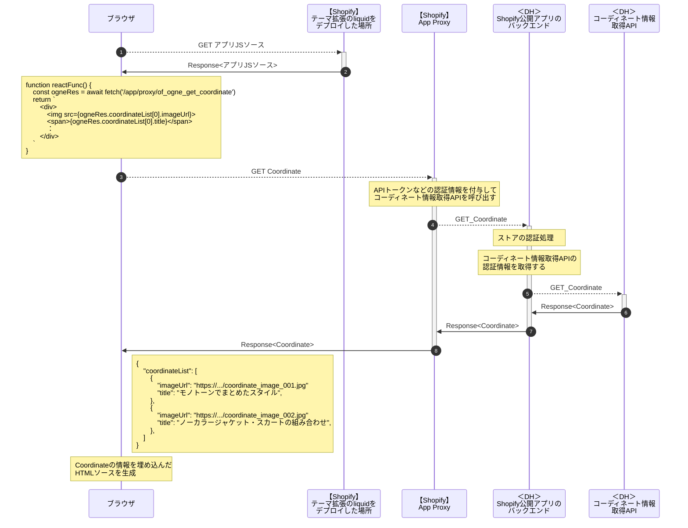

```css
document.head.innerHTML += `
    <style type="text/css">
        .actor[name="shopify_liquid"] {
            fill: aquamarine !important;
        }
        .actor[name="shopify_app_proxy"] {
            fill: aquamarine !important;
        }
        .actor[name="dh_shopify_backend"] {
            fill: antiquewhite !important;
        }
        .actor[name="dh_api"] {
            fill: antiquewhite !important;
        }
    </style>
`;
```
