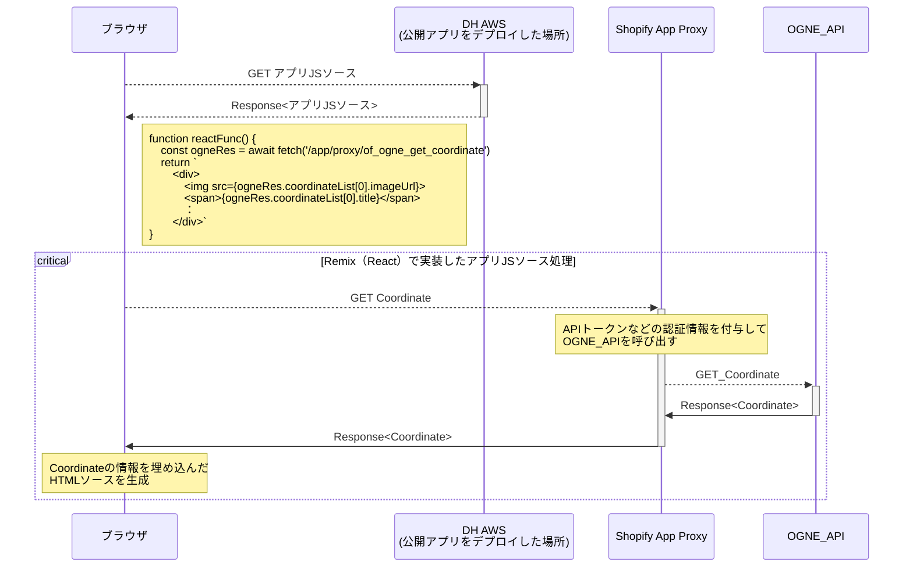

```mermaid
%%{
    init: {
        "noteAlign": "left",
        "logLevel": "debug"
    }
}%%

sequenceDiagram
    participant ブラウザ
    participant DH_AWS as DH AWS<br/>(公開アプリをデプロイした場所)
    participant App_Proxy as Shopify App Proxy
    participant OGNE_API

    ブラウザ-->>+DH_AWS: GET アプリJSソース
    DH_AWS-->>-ブラウザ: Response<アプリJSソース>
    Note right of ブラウザ: function reactFunc() {<br/>　const ogneRes = await fetch('/app/proxy/of_ogne_get_coordinate')<br/>　return `<br/>　　<div><br/>　　　<img src={ogneRes.coordinateList[0].imageUrl}><br/>　　　<span>{ogneRes.coordinateList[0].title}</span><br/>　　　：<br/>　　</div>`<br/>}
    critical Remix（React）で実装したアプリJSソース処理
    ブラウザ-->>+App_Proxy: GET Coordinate
    Note over App_Proxy: APIトークンなどの認証情報を付与して<br/>OGNE_APIを呼び出す
    App_Proxy-->>+OGNE_API: GET_Coordinate
    OGNE_API->>-App_Proxy: Response<Coordinate>
    App_Proxy->>-ブラウザ: Response<Coordinate>
    Note over ブラウザ: Coordinateの情報を埋め込んだ<br/>HTMLソースを生成
    end
```
