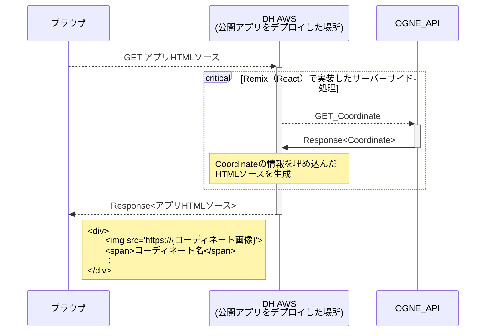

```mermaid
%%{
    init: {
        "noteAlign": "left",
        "logLevel": "debug"
    }
}%%

sequenceDiagram
    participant ブラウザ
    participant DH_AWS as DH AWS<br/>(公開アプリをデプロイした場所)
    participant OGNE_API

    ブラウザ-->>+DH_AWS: GET アプリHTMLソース
    critical Remix（React）で実装したサーバーサイド処理
    DH_AWS-->>+OGNE_API: GET_Coordinate
    OGNE_API->>-DH_AWS: Response<Coordinate>
    Note over DH_AWS: Coordinateの情報を埋め込んだ<br/>HTMLソースを生成
    end
    DH_AWS-->>-ブラウザ: Response<アプリHTMLソース>
    Note right of ブラウザ: <div><br/>　　<img src="https://{コーディネート画像}"><br/>　　<span>コーディネート名</span><br/>　　：<br/></div>
```
